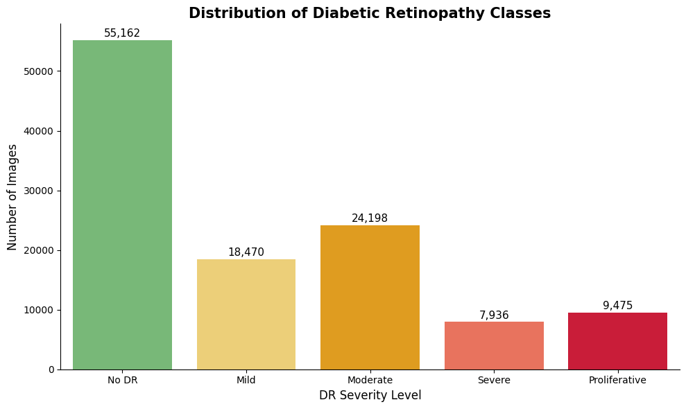
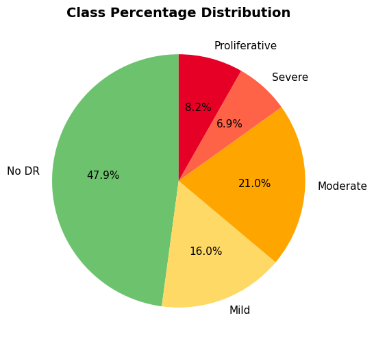
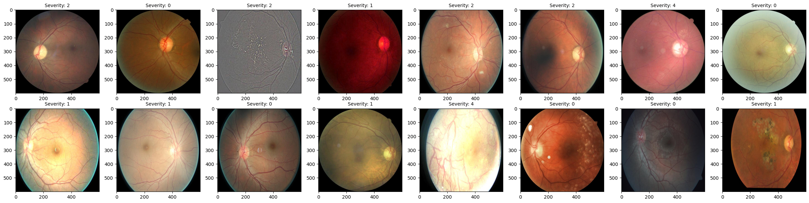
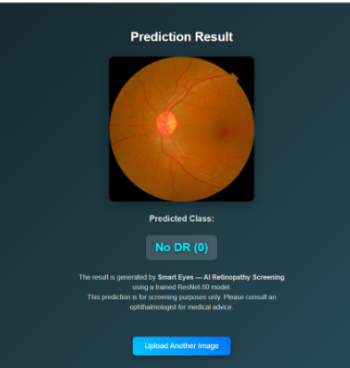
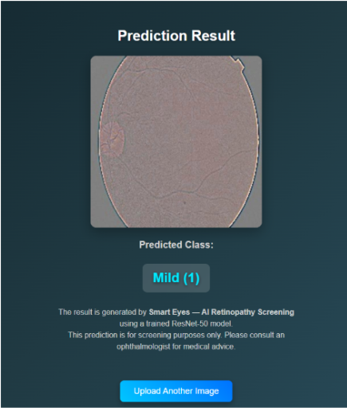
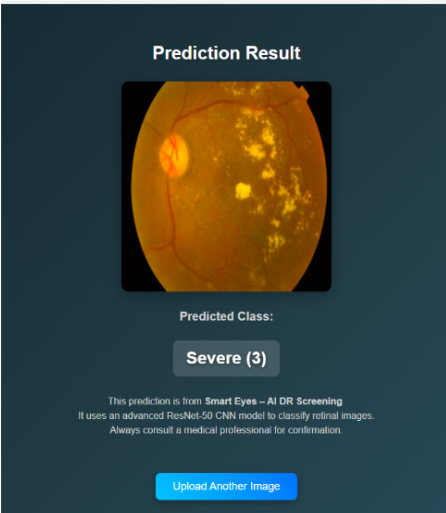
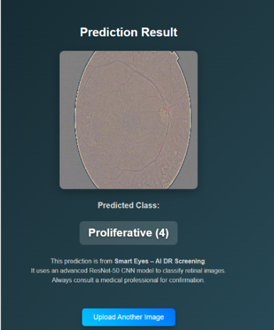

# Diabetic-retinopathy-preprocessing-resnet50

Diabetic Retinopathy (DR) is a leading cause of vision loss in India, especially in rural areas where access to eye specialists and diagnostic tools is limited. There is a need for an automated, affordable, and accessible system to detect and classify DR from retinal images, enabling early diagnosis and timely treatment without relying heavily on in-person consultations.

dataset source : EyePacs from kagglr (22 Gb)

class disrtribution(training):

color distibution - all images are RGB channel

sample images

augmenation:

results - implementation

